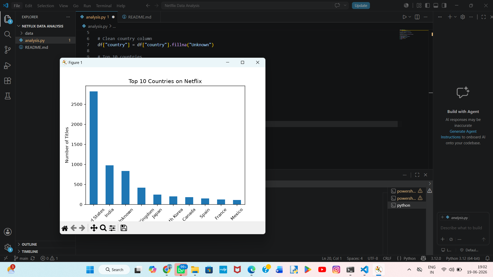

# Netflix Data Analysis

## Overview

This project analyzes Netflix content using Python, Pandas, and Matplotlib. The dataset contains 8,807 Netflix titles, including Movies and TV Shows. The goal is to clean the data, perform exploratory data analysis (EDA), and visualize key trends.

## Technologies Used

* Python
* Pandas
* Matplotlib
* Seaborn
* Git
* GitHub

## Dataset Information

* Total Records: 8,807
* Total Features: 12
* Features include title, type, country, release year, rating, genre, and more.

## Analysis Performed

* Data Loading
* Data Exploration
* Missing Value Analysis
* Data Cleaning
* Missing Value Handling
* Content Type Analysis
* Country-wise Analysis
* Release Year Analysis
* Data Visualization

## Key Findings

* Netflix contains significantly more Movies than TV Shows.
* Content production peaked between 2017 and 2020.
* Missing values were identified and cleaned before analysis.
* Country-wise analysis highlights the major contributors to Netflix content.

## Visualization



## How to Run

```bash
pip install pandas matplotlib seaborn
python analysis.py
```

## Project Structure

```text
Netflix-Data-Analysis/
│
├── data/
│   └── netflix_titles.csv
│
├── analysis.py
├── chart.png
└── README.md
```

## Author

Naveen B

